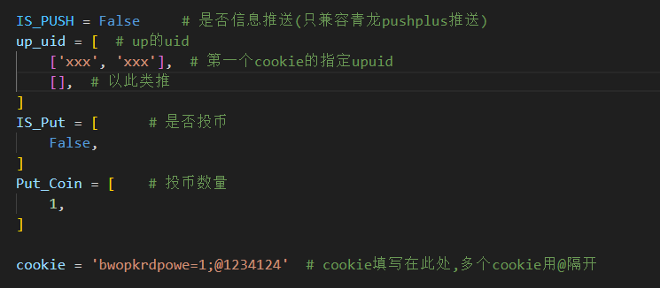

# 自动完成 每日签到、直播签到、分享视频、观看视频、视频投币、银瓜子兑换硬币

## 使用说明

### 使用前请安装以下库👉 request_html、time、random

### 或在控制台运行👉 **pip install -r requirements.txt**

## 配置文件
1. User_Cookie 👉 打开B站按F12在网络请求里获取你的Cookie
2. Work_Cookie 👉 你Cookie是否执行脚本(False / True)不填写则为True
3. Day_Task 👉 你Cookie是否执行每日任务(False / True)不填写则为True
4. Appoint_Up 👉 你Cookie是否要指定Up主的视频 ["456664753","xxxx"] 不填写则为随机
5. Put_Coin 👉 你Cookie是否执行视频投币(False / True)不填写则为True
6. Coin_Number 👉 你Cookie的投币数量 1 或 2 (不填写则为1)
7. Exchange_Coin 👉 你Cookie是否执行兑换(False / True)不填写则为True
## 

